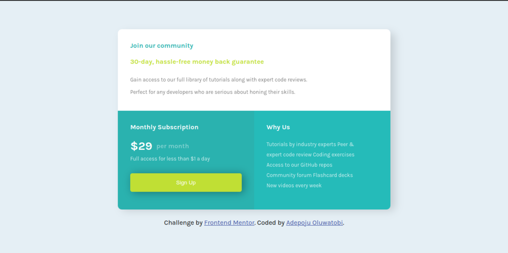

# Frontend Mentor - Single price grid component solution

This is a solution to the [Single price grid component challenge on Frontend Mentor](https://www.frontendmentor.io/challenges/single-price-grid-component-5ce41129d0ff452fec5abbbc). Frontend Mentor challenges help you improve your coding skills by building realistic projects.

## Table of contents

- [Overview](#overview)
  - [The challenge](#the-challenge)
  - [Screenshot](#screenshot)
  - [Links](#links)
- [My process](#my-process)
  - [Built with](#built-with)
  - [What I learned](#what-i-learned)
  - [Continued development](#continued-development)
- [Acknowledgments](#acknowledgments)

## Overview

### The challenge

Users should be able to:

- View the optimal layout for the component depending on their device's screen size
- See a hover state on desktop for the Sign Up call-to-action

### Screenshot

### Links

- Solution URL: [Add solution URL here](https://github.com/adepoju-oluwatobi/social-price-grid-component)
- Live Site URL: [Add live site URL here](https://your-live-site-url.com)

## My process

- I started by putting necessary tags around text provided
- Next, I give all the elements class so as to be able to style them
- After making sure my html structure is in place, i start with the css design using the mobile first concept
- After finishing up with the mobile view i designed the desktop view
- And finally i pushed to github and hosted on vercel

### Built with

- Semantic HTML5 markup
- CSS custom properties
- Flexbox
- Mobile-first workflow

### What I learned

I have come to realise that the easiest designs are always the toughest to write.
I leart a whole deal with flexbox

### Continued development

Moving forward i will try to create a neat css file for all websites, for readability

## Acknowledgments

A huge thanks to Rachael Odudu for always spoting my mistakes and giving ,e insight as to what to do to achieve a perfect design.
